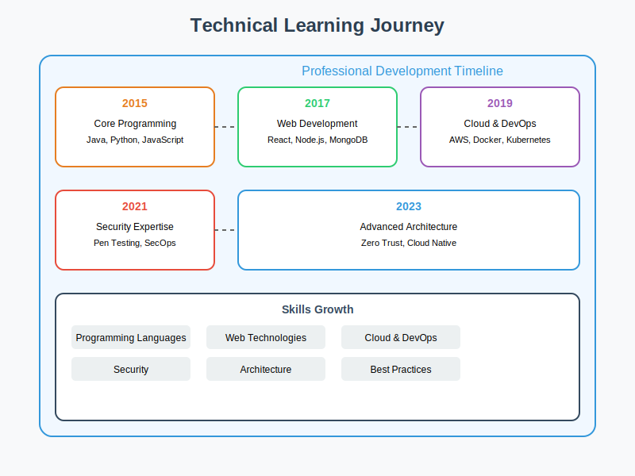
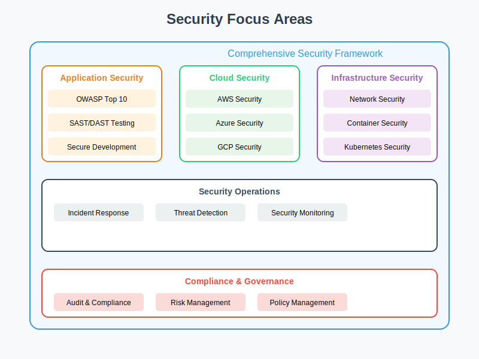
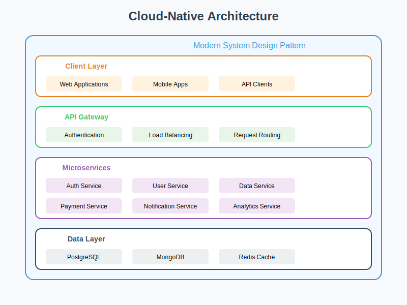

<!-- Profile Picture -->
<p align="center">
  
</p>

<!-- Header with wave animation -->
<h1 align="center">
  👋 Welcome to My Digital Universe! 
</h1>

<!-- Subtitle -->
<p align="center">
  <strong>🚀 Full-Stack Developer & Technical Architect | 🔐 Security Expert | 🎯 Solution Designer</strong>
</p>

<!-- Table of Contents -->
## 📑 Table of Contents
- [About Me](#-about-me)
- [Technical Journey](#-technical-journey)
- [Security Expertise](#-security-expertise)
- [Architecture & Design](#-architecture--design)
- [Technical Arsenal](#%EF%B8%8F-technical-arsenal)
- [What I'm Up To](#-what-im-up-to)
- [Key Projects](#-key-projects)
- [Let's Connect](#-lets-connect)
- [Fun Facts](#-fun-facts)

<!-- Divider -->
<p align="center">
  
</p>

<!-- About Me Section -->
### 🌟 About Me

I'm a passionate technologist who transforms complex challenges into elegant solutions. With a deep focus on security and scalable architectures, I bridge the gap between innovation and reliability.

```python
class TechArchitect:
    def __init__(self):
        self.current_focus = ["Cloud Architecture", "Security Solutions", "System Design"]
        self.daily_fuel = ["☕ Coffee", "🎵 Music", "💡 Innovation"]
        self.mission = "Building secure, scalable, and innovative solutions"
```

<!-- Technical Journey Section -->
### 📈 Technical Journey

<p align="center">
  
</p>

<!-- Security Expertise Section -->
### 🔒 Security Expertise

<p align="center">
  
</p>

<!-- Architecture & Design Section -->
### 🏗️ Architecture & Design

<p align="center">
  
</p>

<!-- Expertise Section -->
### 🛠️ Technical Arsenal

<details>
<summary>🔥 Core Technologies</summary>
<br>

- **Backend**: Java, Python, Node.js, Go
- **Frontend**: React, Angular, Vue.js
- **Cloud**: AWS, Azure, GCP
- **Security**: Penetration Testing, Security Auditing, Compliance
- **Architecture**: Microservices, Serverless, Event-Driven
- **DevOps**: Docker, Kubernetes, CI/CD
</details>

<details>
<summary>🎯 Specialized Focus</summary>
<br>

- **Database Security**
- **Cloud Infrastructure Protection**
- **Application Security**
- **Security Training & Workshops**
- **Architecture Consulting**
</details>

<!-- Current Endeavors -->
### 🚀 What I'm Up To

```javascript
const currentProjects = {
  learning: "Advanced Cloud Security Patterns",
  building: "Secure Architecture Templates",
  exploring: "Zero Trust Security Models",
  sharing: "Security Best Practices"
};
```

<!-- Key Projects Section -->
### 🌟 Key Projects

- [Project One](https://github.com/dbsectrainer/ProjectOne): A brief description of what this project is about.
- [Project Two](https://github.com/dbsectrainer/ProjectTwo): A brief description of what this project is about.

<!-- Connect Section -->
### 🤝 Let's Connect

<p align="left">
  <a href="https://linkedin.com/in/dbsectrainer" target="_blank">
    
  </a>
  <a href="mailto:your.email@example.com" target="_blank">
    
  </a>
  <a href="https://yourwebsite.com" target="_blank">
    
  </a>
</p>

<!-- Fun Facts -->
### 🎮 Fun Facts

- 💡 I believe every system can be both secure and user-friendly
- 🌱 Always learning and exploring new technologies
- 🎵 Code better with music
- 🌍 Tech communities make us stronger

<!-- Interactive Elements -->
<p align="center">
  
</p>

<!-- Footer -->
<p align="center">
  <i>Let's build something amazing together!</i>
</p>

<p align="center">
  
</p>
