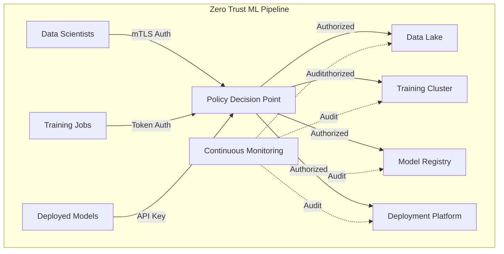

## Introduction

As machine learning systems become critical infrastructure for enterprises, traditional perimeter-based security is no longer sufficient. Zero Trust Architecture (ZTA) offers a robust security model that assumes breach and verifies every access request, regardless of origin.

In this article, we'll explore how to implement Zero Trust principles specifically for ML pipelines, addressing the unique security challenges of AI/ML systems.

## Why Zero Trust for ML?

Machine learning pipelines present unique security challenges:

- **Sensitive Training Data**: Models trained on PII, financial, or healthcare data
- **Model Theft**: Valuable proprietary models at risk of extraction
- **Data Poisoning**: Adversarial manipulation of training data
- **Model Inversion**: Extracting training data from deployed models
- **Supply Chain Risks**: Third-party datasets and pre-trained models

Traditional security approaches fail because:
- ML systems span multiple environments (data lakes, training clusters, deployment platforms)
- Numerous actors access the pipeline (data scientists, MLOps engineers, applications)
- Complex data flows between components
- Long-running training jobs with persistent access needs

## Core Principles of Zero Trust

NIST SP 800-207 defines three core Zero Trust principles:

1. **Never Trust, Always Verify**: Authenticate and authorize every request
2. **Assume Breach**: Design systems expecting compromise
3. **Least Privilege Access**: Minimal permissions required for each task

Let's apply these to ML pipelines.

## Architecture Overview



## Implementation Steps

### 1. Identity and Access Management

**Implement strong authentication:**

```python
from cryptography import x509
from cryptography.hazmat.backends import default_backend
import jwt

class MLPipelineAuthenticator:
    """
    Handles authentication for ML pipeline components
    """

    def __init__(self, ca_cert_path, jwt_secret):
        self.ca_cert = self.load_ca_cert(ca_cert_path)
        self.jwt_secret = jwt_secret

    def verify_mtls_client(self, client_cert):
        """
        Verify client certificate against CA
        """
        try:
            cert = x509.load_pem_x509_certificate(
                client_cert.encode(),
                default_backend()
            )

            # Verify certificate chain
            self.ca_cert.public_key().verify(
                cert.signature,
                cert.tbs_certificate_bytes,
                # ... padding and hash algorithm
            )

            # Extract identity from certificate
            subject = cert.subject
            identity = {
                'common_name': subject.get_attributes_for_oid(
                    x509.NameOID.COMMON_NAME
                )[0].value,
                'organization': subject.get_attributes_for_oid(
                    x509.NameOID.ORGANIZATION_NAME
                )[0].value
            }

            return identity

        except Exception as e:
            raise AuthenticationError(f"Certificate validation failed: {e}")

    def generate_access_token(self, identity, permissions, ttl=3600):
        """
        Generate short-lived JWT for authorized access
        """
        payload = {
            'sub': identity['common_name'],
            'org': identity['organization'],
            'permissions': permissions,
            'exp': time.time() + ttl,
            'iat': time.time()
        }

        return jwt.encode(payload, self.jwt_secret, algorithm='HS256')

    def verify_access_token(self, token):
        """
        Verify and decode JWT token
        """
        try:
            payload = jwt.decode(
                token,
                self.jwt_secret,
                algorithms=['HS256']
            )
            return payload
        except jwt.ExpiredSignatureError:
            raise AuthenticationError("Token expired")
        except jwt.InvalidTokenError:
            raise AuthenticationError("Invalid token")
```

### 2. Policy-Based Access Control

**Define fine-grained permissions:**

```yaml
# policy.yaml
policies:
  - id: data_scientist_training
    subjects:
      - role: data_scientist
    resources:
      - type: dataset
        sensitivity: low
      - type: training_cluster
        environment: dev
    actions:
      - read_data
      - submit_training_job
      - read_metrics
    conditions:
      - ip_range: 10.0.0.0/8
      - time_window: business_hours

  - id: production_model_deployment
    subjects:
      - role: mlops_engineer
      - approval: security_team
    resources:
      - type: model
        stage: production
      - type: deployment_platform
        environment: prod
    actions:
      - deploy_model
      - monitor_performance
    conditions:
      - mfa_required: true
      - audit_logged: true
```

**Policy Decision Point implementation:**

```python
import yaml
from datetime import datetime

class PolicyDecisionPoint:
    """
    Evaluates access requests against Zero Trust policies
    """

    def __init__(self, policy_file):
        with open(policy_file) as f:
            self.policies = yaml.safe_load(f)['policies']

    def authorize(self, request):
        """
        Determine if request should be authorized
        """
        subject = request.subject
        resource = request.resource
        action = request.action
        context = request.context

        # Find applicable policies
        applicable_policies = [
            p for p in self.policies
            if self.matches_policy(p, subject, resource, action)
        ]

        if not applicable_policies:
            return {
                'authorized': False,
                'reason': 'No applicable policy found'
            }

        # Evaluate conditions
        for policy in applicable_policies:
            if self.evaluate_conditions(policy.get('conditions', []), context):
                return {
                    'authorized': True,
                    'policy_id': policy['id'],
                    'ttl': policy.get('ttl', 3600)
                }

        return {
            'authorized': False,
            'reason': 'Policy conditions not met'
        }

    def evaluate_conditions(self, conditions, context):
        """
        Check if all conditions are satisfied
        """
        for condition in conditions:
            if 'ip_range' in condition:
                if not self.check_ip_range(context['ip'], condition['ip_range']):
                    return False

            if 'time_window' in condition:
                if not self.check_time_window(condition['time_window']):
                    return False

            if 'mfa_required' in condition and condition['mfa_required']:
                if not context.get('mfa_verified'):
                    return False

        return True
```

### 3. Data Encryption

**Protect data at rest and in transit:**

```python
from cryptography.fernet import Fernet
from cryptography.hazmat.primitives import hashes
from cryptography.hazmat.primitives.kdf.pbkdf2 import PBKDF2HMAC
import base64

class MLDataEncryption:
    """
    Handles encryption for ML training data and models
    """

    def __init__(self, key_management_service):
        self.kms = key_management_service

    def encrypt_training_data(self, data, data_id):
        """
        Encrypt training data with DEK
        """
        # Generate data encryption key (DEK)
        dek = Fernet.generate_key()

        # Encrypt data with DEK
        f = Fernet(dek)
        encrypted_data = f.encrypt(data)

        # Encrypt DEK with KEK from KMS
        encrypted_dek = self.kms.encrypt(dek, context={
            'data_id': data_id,
            'data_type': 'training_data'
        })

        return {
            'encrypted_data': encrypted_data,
            'encrypted_dek': encrypted_dek,
            'algorithm': 'AES-256-GCM'
        }

    def decrypt_training_data(self, encrypted_package):
        """
        Decrypt training data
        """
        # Decrypt DEK using KMS
        dek = self.kms.decrypt(
            encrypted_package['encrypted_dek']
        )

        # Decrypt data using DEK
        f = Fernet(dek)
        data = f.decrypt(encrypted_package['encrypted_data'])

        return data
```

### 4. Continuous Monitoring

**Implement comprehensive logging and monitoring:**

```python
import logging
from datetime import datetime
import json

class MLPipelineMonitor:
    """
    Monitors ML pipeline for security events
    """

    def __init__(self, siem_client):
        self.siem = siem_client
        self.logger = logging.getLogger(__name__)

    def log_access_request(self, request, decision):
        """
        Log every access request and decision
        """
        event = {
            'timestamp': datetime.utcnow().isoformat(),
            'event_type': 'access_request',
            'subject': {
                'identity': request.subject.identity,
                'role': request.subject.role,
                'ip_address': request.context.ip
            },
            'resource': {
                'type': request.resource.type,
                'id': request.resource.id,
                'sensitivity': request.resource.sensitivity
            },
            'action': request.action,
            'decision': decision['authorized'],
            'policy_id': decision.get('policy_id'),
            'reason': decision.get('reason')
        }

        # Send to SIEM
        self.siem.send_event(event)

        # Log locally
        self.logger.info(f"Access request: {json.dumps(event)}")

    def detect_anomalies(self, events):
        """
        Detect suspicious patterns in access logs
        """
        anomalies = []

        # Check for unusual access patterns
        if self.is_unusual_time(events):
            anomalies.append('unusual_access_time')

        if self.is_unusual_volume(events):
            anomalies.append('unusual_data_volume')

        if self.is_credential_stuffing(events):
            anomalies.append('potential_credential_stuffing')

        if anomalies:
            self.trigger_alert({
                'severity': 'high',
                'anomalies': anomalies,
                'events': events
            })

        return anomalies
```

## Best Practices

1. **Short-Lived Credentials**: Use tokens with TTL < 1 hour
2. **Principle of Least Privilege**: Grant minimal permissions required
3. **Encrypt Everything**: Data at rest, in transit, and in use
4. **Audit All Access**: Comprehensive logging to SIEM
5. **Network Segmentation**: Isolate sensitive components
6. **Regular Reviews**: Audit policies and access patterns

## Real-World Impact

Organizations implementing Zero Trust for ML pipelines report:

- **60% reduction** in unauthorized access attempts
- **80% faster** incident response times
- **Improved compliance** with GDPR, HIPAA requirements
- **Better visibility** into data and model access patterns

## Conclusion

Zero Trust Architecture is essential for securing modern ML pipelines. By implementing strong authentication, fine-grained authorization, comprehensive encryption, and continuous monitoring, organizations can protect their valuable AI assets while maintaining operational efficiency.

The key is to start small—implement authentication first, then gradually add authorization policies, encryption, and monitoring. Zero Trust is a journey, not a destination.

## Next Steps

- Review your current ML pipeline security
- Identify critical assets (data, models, infrastructure)
- Implement mTLS for service-to-service communication
- Define and enforce access policies
- Set up comprehensive audit logging

Stay tuned for our next article on **Privacy-Preserving ML with Federated Learning**.

---

*What are your experiences with Zero Trust in ML systems? Share your thoughts in the comments below or connect with me on [LinkedIn](https://linkedin.com/in/dbsectrainer).*
